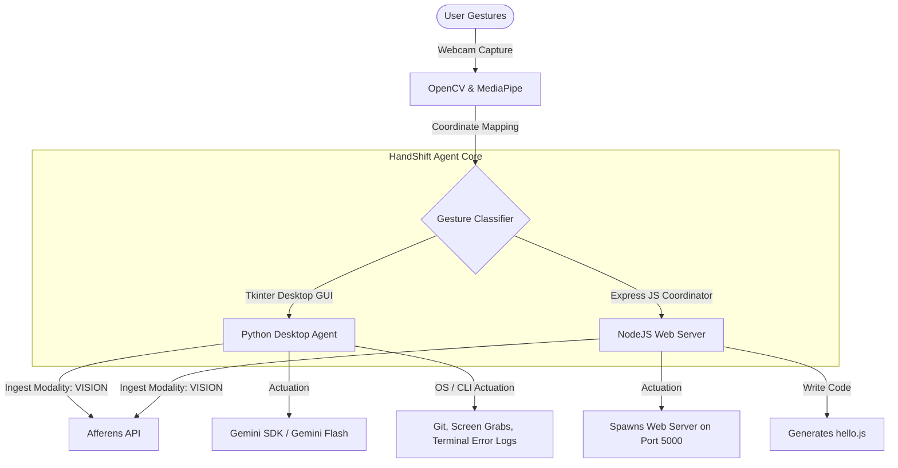

# HandShift: Physical Gesture Perception Agent

<p align="center">
  
  
  
</p>

<p align="center">
  <strong>Bridging the physical-digital gap by giving AI agents physical perception, real-world awareness, and gestural actuation.</strong>
</p>

---

## YouTube Demo & Walkthrough

Click the preview below to watch the project demonstration on YouTube:

[](https://www.youtube.com/watch?v=45Cm8BxmnBQ)

*Watch the agent parse gesture inputs, ingest data into the Afferens sensory layer, and actuate IDE commands in real-time.*

---

## The Problem & The Challenge

### The Problem
AI agents are blind. They reason brilliantly over text but have no verified awareness of the physical world — they can't see what's in front of them, confirm it, or ground a decision in reality before acting. That gap is what keeps agents from being trusted in hardware, robotics, and the real world.

### The Challenge
Build a project where an AI agent uses the **Afferens API** to perceive its environment and act on it — a closed loop of real-world input, grounded perception, and intelligent action. Show the agent sensing the world, then doing something only possible because it can.

---

## Architecture & Tech Stack

HandShift acts as the **afferent sensory pathway** for the developer workspace. Using a webcam, the system registers spatial hand movements, classifies them using MediaPipe, pushes the physical states to the **Afferens Cloud API**, and triggers corresponding workspace actuations.



---

## Features & Gesture Map

HandShift is structured into a dual-mode control system: a **Python Desktop Agent** for deep IDE automation and a **Node.js Web Interface** for visual server coordination.

### Python Desktop Gestures (vision_agent.py)
The Tkinter application continuously tracks the following gestures to actuate key developer workflows:

| Gesture | Action Name | Workspace Actuation Description |
| :--- | :--- | :--- |
| **Fist (0)** | Summarize Workspace File | Fetches the newest modified file in the workspace and generates a plain English summary using the Gemini SDK. |
| **One Finger** | Explain Last CLI Error | Locates the latest `.log` error trace file in the system tasks directory and suggests fixes using Gemini. |
| **Peace Sign (2)** | Clipboard AI Search | Takes whatever text is currently copied to your clipboard and executes an intelligent search prompt query with Gemini. |
| **Three Fingers** | Screenshot & Paste to Gemini | Snaps a screenshot of the display, copies it to the clipboard, opens the Gemini Web UI, and automatically pastes and asks to analyze it. |
| **Four Fingers** | Git Auto Commit & Push | Automates codebase syncs by performing `git add .`, committing with a randomized gesture tag, and pushing to the remote branch. |
| **Open Hand (5)** | Google Clipboard Query | Launches a web browser searching Google for the current contents of the system clipboard. |
| **Two Hands** | Open Gemini & Paste | Opens the Gemini web portal in your browser and automatically simulates pasting your current clipboard text. |

### Node.js Web Gestures (server.js + public/)
The web panel coordinates lightweight, browser-based hand tracking:

*   **Open Hand:** Opens the web browser debugging window and logs active agent diagnostics.
*   **Peace Sign:** Spawns a secondary, fully sandboxed web project server on port 5000.
*   **Pointing:** Generates and writes raw Node/JS code (hello.js) straight to the workspace.

---

## Afferens API Integration

To bridge real-world physical perception, HandShift ingests physical inputs into the Afferens sensory layer.

### 1. Setup & API Key Generation
1. Sign up and grab your free API key (includes 10,000 free Sense Tokens, no credit card required) at: **[https://afferens.com/signup](https://afferens.com/signup)**.
2. Your key will follow the format: `aff_live_a1b2c3d4e5f6…`
3. Store this key in your environment configuration (see configuration section below). All requests to the ingest endpoint must include this in the `X-API-KEY` header.

### 2. Zero-Setup Demo Endpoint Test
You can test the Afferens system immediately without any local setup by executing the following cURL test command:
```bash
curl "https://afferens.com/api/demo?modality=VISION"
```

### 3. Direct Ingestion Code Hook
Gestures are ingested using a `POST` request to `https://afferens.com/api/ingest` with the `VISION` modality:
```json
{
  "modality": "VISION",
  "data": {
    "gesture": "open_hand",
    "timestamp": "2026-06-22T18:23:26Z"
  },
  "classification": "open hand"
}
```

---

## Installation & Local Setup

### Environment Configuration
Create a `.env` file in the root of the project containing:
```env
GEMINI_API_KEY=your_gemini_api_key_here
AFFERENS_API_KEY=your_afferens_api_key_here
```

### Running the Python Desktop Agent (Tkinter + MediaPipe)

1. **Install Python dependencies:**
   Make sure you have your virtual environment activated, then install the packages listed in `requirements.txt`:
   ```bash
   pip install -r requirements.txt
   ```
   *Note: On macOS, ensure you have Tkinter and your camera access permissions granted to your terminal.*

2. **Launch the agent:**
   ```bash
   python vision_agent.py
   ```
3. Click **Expand Camera Feed & Logs** to view your webcam capture and real-time tracking statistics.

### Running the Node.js Web Server

1. **Install node dependencies:**
   ```bash
   npm install
   ```
2. **Start the server:**
   ```bash
   npm start
   ```
3. Open your browser and navigate to **[http://localhost:3000](http://localhost:3000)** to launch the visual control dashboard.

---

## Submission Requirements Checklist

Before submitting, make sure the project aligns with the track requirements:

- [x] **GitHub Repository:** Clean, structured codebase featuring this premium `README.md`.
- [x] **Demo Video:** Walkthrough video demonstrating real-world gesture detection and automation. [Watch on YouTube](https://www.youtube.com/watch?v=45Cm8BxmnBQ).
- [x] **Tool Integration:** Fully verified integration with the **Afferens API** (`X-API-KEY` ingestion flow) for physical gesture perception.
- [x] **Grounded Perception & Action Loop:** Real-world gestures translate directly into digital outputs, creating a closed-loop system.

---

## License

This project is licensed under the MIT License. See the [LICENSE](LICENSE) file for details.
